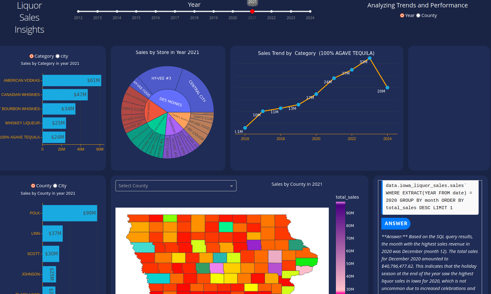

# Sales Dashboard with Plotly Dash

## Overview

This project involves building an interactive sales dashboard using Plotly Dash in Python. The dashboard visualizes sales data by product, year, and region. It also features an integrated chatbot that leverages the Claude API to retrieve data from BigQuery and respond to user queries in natural language.

### Key Features:
- **Sales Visualization:** Displays sales trends by product, year, and region.
- **Interactive Chatbot:** Ask questions about the sales data, and the chatbot will fetch and provide insights using natural language processing.
- **Data Source:** Iowa Liquor Retail Sales dataset.

### Live Demo
The dashboard is hosted on a Google Cloud Platform (GCP) Virtual Machine. You can view it live here:
- [Dashboard Link](http://104.197.202.155:8080/)

### Source Code
The source code for this project is available on my GitHub repository:
- [GitHub Repository](https://github.com/RicmwasData/plotly-dash-llm)

### Video Demonstration

*(Replace the URL with the link to your video)*

## Skills Used
- **Python** (3.10.12)
- **BigQuery**
- **Langchain**
- **LLM**
- **Data Analysis**
- **Google Cloud Platform (GCP)**
- **Git and GitHub**

## Requirements
- **Sales Data:** Iowa Liquor Retail Sales
- **Libraries:** Plotly Dash, Langchain, and others (refer to `requirements.txt`)

## Data

### Name:
Iowa Liquor Retail Sales

### Source:
[Iowa Liquor Retail Sales Dataset](https://console.cloud.google.com/marketplace/product/iowa-department-of-commerce/iowa-liquor-sales?project=stalwart-elixir-301510)

### Overview:
This dataset contains every wholesale purchase of liquor in the State of Iowa by retailers for sale to individuals since January 1, 2012. It offers a complete view of retail liquor sales across the state, including details about the store, location, liquor brand, size, and number of bottles ordered.

### Use Case:
Stockout prediction and retail demand forecasting.

### Data Dictionary:
[Data Dictionary](https://data.iowa.gov/Sales-Distribution/Iowa-Liquor-Sales/m3tr-qhgy/about_data)

## Python Version
- Python 3.10.12

## Libraries
Refer to `requirements.txt` for a complete list of libraries used in this project.

## References
1. **Data:** [Iowa Liquor Sales](https://console.cloud.google.com/marketplace/product/iowa-department-of-commerce/iowa-liquor-sales?project=stalwart-elixir-301510)
2. **Example Dash:** [Example Dashboard](https://wasmdash.vercel.app/)
3. **Graphs:** [Plotly Graphs](https://plotly.com/python/?_gl=1*bxn979*_gcl_au*MTg1Nzc0NTAwMy4xNzIyMzk3OTk0*_ga*MjY0MTc1MzQyLjE3MjIzOTc5OTU.*_ga_6G7EE0JNSC*MTcyMjU4NTg2My40LjEuMTcyMjU4Nzc2MC42MC4wLjA.)
4. **Dash Core Components:** [Dash Core Components](https://dash.plotly.com/dash-core-components)
5. **Dash HTML Components:** [Dash HTML Components](https://dash.plotly.com/dash-html-components)
6. **Cities Data:** [US Cities Data](https://simplemaps.com/data/us-cities)
7. **Counties Geo Data:** [Counties Geo Data](https://www2.census.gov/geo/tiger/GENZ2018/shp/cb_2018_us_county_500k.zip)
8. **How to Create Data Maps:** [Creating Data Maps](https://dev.to/oscarleo/how-to-create-data-maps-of-the-united-states-with-matplotlib-p9i)
9. **Langchain Tutorial:** [Langchain Tutorial](https://alejandro-ao.com/chat-with-mysql-using-python-and-langchain/)

---

Feel free to contribute to this project or report any issues. Your feedback is welcome!
